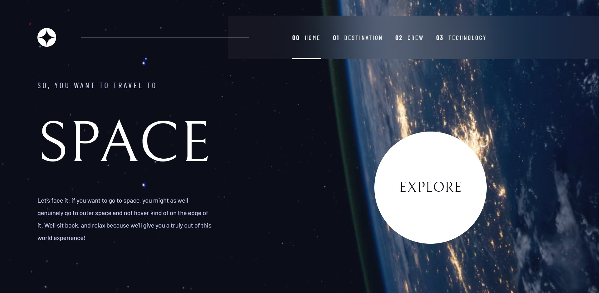
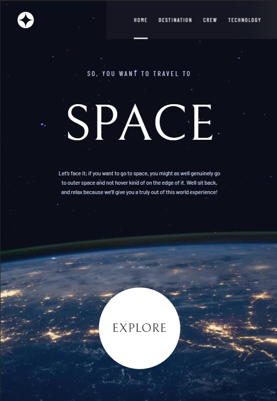
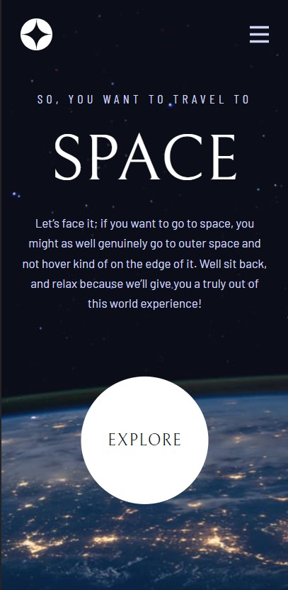

# Frontend Mentor - Space tourism website solution

This is a solution to the [Space tourism website challenge on Frontend Mentor](https://www.frontendmentor.io/challenges/space-tourism-multipage-website-gRWj1URZ3). Frontend Mentor challenges help you improve your coding skills by building realistic projects. 

## Table of contents

- [Overview](#overview)
  - [The challenge](#the-challenge)
  - [Screenshot](#screenshot)
  - [Links](#links)
- [My process](#my-process)
  - [Built with](#built-with)
  - [Continued development](#continued-development)
- [Author](#author)

## Overview

### The challenge

Users should be able to:

- View the optimal layout for each of the website's pages depending on their device's screen size
- See hover states for all interactive elements on the page
- View each page and be able to toggle between the tabs to see new information

### Screenshot

### Links

- Solution URL: [GitHub](https://github.com/8xMohab/space-tourism-website)
- Live Site URL: [Netlify](https://space-tourism-8xmohab.netlify.app)

## My process

I started working on this project by looking at the design in Figma and forming a general idea of how I was going to build the layout, web structure, and components. then I built the html structure and the JS functionalities, then added the styles with tailwind css.

### Built with

- [React](https://reactjs.org/) - JS library
- [Tailwind CSS](https://tailwindcss.com/) - CSS framework
- [Vite](https://vitejs.dev/) - JS build tool
- Mobile-first workflow

### Continued development

- Optimisation and grouping of repetitive properties into custom classes.
- Improving the layout on the very large screens (2k - 4k).

## Author

- Frontend Mentor - [@8xMohab](https://www.frontendmentor.io/profile/8xMohab)
- Twitter - [@8xMohab](https://www.twitter.com/8xMohab)